# Lawarna Portfolio — Full-Stack Implementation Plan

## Inspiration Analysis

| Site | Key Takeaways to Adopt |
|---|---|
| **Chris Macari Films** | Dark cinematic theme, Lenis smooth scroll, asymmetric masonry grid for projects, bold uppercase typography (Druk Wide-style), red accent on pure black, video-centric hero, GSAP scroll-triggered reveals |
| **Shader.se** | 3D/interactive hero section, project carousel with hover previews, bold "plugged into the future" headline style, smooth section transitions, CTA buttons with hover effects |
| **New Studio** | Clean minimal typography, case-study cards with tag pills, elegant fullscreen menu overlay, smooth page transitions, large editorial text blocks, refined footer |
| **Yan Liu** | Playful draggable/interactive elements, personality-driven design, creative "about" section, social links integration, workspace-style layout |

### Design Direction for Your Portfolio
- **Theme**: Dark mode primary (`#0a0a0a`) with warm accent (`#e8572a` burnt orange)
- **Typography**: Clash Display (headings) + Satoshi (body) — both from Fontshare (free)
- **Vibe**: Cinematic + editorial, with smooth GSAP scroll animations and Lenis buttery scrolling
- **Layout**: Asymmetric grids, full-bleed hero, horizontal scroll sections, parallax layers

---

## 1) pnpm Dependency Installation Commands

### Prerequisites
```powershell
# Install pnpm globally if not already installed
npm install -g pnpm
```

### Web Frontend (`d:\portfolio\web`)
```powershell
cd d:\portfolio\web

# Core routing & state
pnpm add react-router-dom axios

# Animation & scroll
pnpm add gsap @studio-freight/lenis

# UI utilities
pnpm add splitting    # text splitting for character animations
pnpm add swiper       # project carousel/slider
pnpm add react-intersection-observer  # lazy loading & scroll triggers

# Dev dependencies
pnpm add -D sass      # if you want SCSS (optional, vanilla CSS is fine too)
```

### Admin Panel (`d:\portfolio\admin`)
```powershell
cd d:\portfolio\admin

# Core routing & state
pnpm add react-router-dom axios

# UI components
pnpm add react-icons          # icon library
pnpm add react-hot-toast      # toast notifications
pnpm add react-quill           # rich text editor for project descriptions
pnpm add recharts              # dashboard analytics charts

# Utilities
pnpm add dayjs                 # date formatting
pnpm add react-dropzone        # drag & drop file uploads
```

### Server (`d:\portfolio\server`)
```powershell
cd d:\portfolio\server

# Initialize package.json first
pnpm init

# Core
pnpm add express cors dotenv

# Database
pnpm add mysql2

# Authentication & security
pnpm add bcryptjs jsonwebtoken cookie-parser helmet

# File upload
pnpm add multer

# Validation & utilities
pnpm add express-validator slugify

# Dev dependencies
pnpm add -D nodemon
```

> [!TIP]
> After installing server deps, add these scripts to `server/package.json`:
> ```json
> "scripts": {
>   "dev": "nodemon server.js",
>   "start": "node server.js"
> }
> ```

---

## 2) Database ERD

```mermaid
erDiagram
    admins {
        INT id PK "AUTO_INCREMENT"
        VARCHAR_100 username UK "NOT NULL"
        VARCHAR_255 email UK "NOT NULL"
        VARCHAR_255 password_hash "NOT NULL"
        VARCHAR_255 avatar_url "NULLABLE"
        TIMESTAMP last_login "NULLABLE"
        TIMESTAMP created_at "DEFAULT CURRENT_TIMESTAMP"
        TIMESTAMP updated_at "ON UPDATE CURRENT_TIMESTAMP"
    }

    projects {
        INT id PK "AUTO_INCREMENT"
        VARCHAR_255 title "NOT NULL"
        VARCHAR_255 slug UK "NOT NULL"
        TEXT short_description "NOT NULL"
        TEXT long_description "NULLABLE, rich text HTML"
        VARCHAR_255 thumbnail_url "NOT NULL"
        VARCHAR_255 cover_image_url "NULLABLE"
        VARCHAR_255 live_url "NULLABLE"
        VARCHAR_255 github_url "NULLABLE"
        ENUM status "draft/published/archived DEFAULT draft"
        BOOLEAN is_featured "DEFAULT FALSE"
        INT display_order "DEFAULT 0"
        DATE project_date "NULLABLE"
        TIMESTAMP created_at "DEFAULT CURRENT_TIMESTAMP"
        TIMESTAMP updated_at "ON UPDATE CURRENT_TIMESTAMP"
    }

    project_tags {
        INT id PK "AUTO_INCREMENT"
        VARCHAR_50 name UK "NOT NULL"
        VARCHAR_7 color "NULLABLE, hex code"
        TIMESTAMP created_at "DEFAULT CURRENT_TIMESTAMP"
    }

    project_tag_map {
        INT project_id FK "NOT NULL"
        INT tag_id FK "NOT NULL"
    }

    project_media {
        INT id PK "AUTO_INCREMENT"
        INT project_id FK "NOT NULL"
        VARCHAR_255 file_url "NOT NULL"
        ENUM media_type "image/video"
        VARCHAR_255 alt_text "NULLABLE"
        INT display_order "DEFAULT 0"
        BIGINT file_size "NOT NULL, in bytes"
        TIMESTAMP created_at "DEFAULT CURRENT_TIMESTAMP"
    }

    journey_entries {
        INT id PK "AUTO_INCREMENT"
        VARCHAR_255 title "NOT NULL"
        TEXT description "NOT NULL"
        VARCHAR_255 organization "NULLABLE"
        VARCHAR_255 role "NULLABLE"
        VARCHAR_255 icon_url "NULLABLE"
        ENUM entry_type "education/work/achievement/milestone"
        DATE start_date "NOT NULL"
        DATE end_date "NULLABLE, NULL means present"
        INT display_order "DEFAULT 0"
        BOOLEAN is_visible "DEFAULT TRUE"
        TIMESTAMP created_at "DEFAULT CURRENT_TIMESTAMP"
        TIMESTAMP updated_at "ON UPDATE CURRENT_TIMESTAMP"
    }

    contacts {
        INT id PK "AUTO_INCREMENT"
        VARCHAR_100 name "NOT NULL"
        VARCHAR_255 email "NOT NULL"
        VARCHAR_20 phone "NULLABLE"
        VARCHAR_255 subject "NULLABLE"
        TEXT message "NOT NULL"
        ENUM status "unread/read/replied/archived DEFAULT unread"
        TEXT admin_notes "NULLABLE"
        VARCHAR_45 ip_address "NULLABLE"
        TIMESTAMP created_at "DEFAULT CURRENT_TIMESTAMP"
        TIMESTAMP updated_at "ON UPDATE CURRENT_TIMESTAMP"
    }

    lifestyle_posts {
        INT id PK "AUTO_INCREMENT"
        VARCHAR_255 title "NOT NULL"
        TEXT caption "NULLABLE"
        VARCHAR_255 image_url "NOT NULL"
        ENUM category "travel/food/hobby/fitness/other"
        BOOLEAN is_visible "DEFAULT TRUE"
        INT display_order "DEFAULT 0"
        TIMESTAMP created_at "DEFAULT CURRENT_TIMESTAMP"
    }

    site_settings {
        INT id PK "AUTO_INCREMENT"
        VARCHAR_100 setting_key UK "NOT NULL"
        TEXT setting_value "NULLABLE"
        TIMESTAMP updated_at "ON UPDATE CURRENT_TIMESTAMP"
    }

    about_info {
        INT id PK "AUTO_INCREMENT, single row"
        VARCHAR_255 headline "NOT NULL"
        TEXT bio "NOT NULL, rich text"
        TEXT short_bio "NOT NULL"
        VARCHAR_255 profile_image_url "NULLABLE"
        VARCHAR_255 resume_url "NULLABLE"
        VARCHAR_255 location "NULLABLE"
        VARCHAR_255 email "NULLABLE"
        TEXT skills_json "JSON array of skill objects"
        TEXT social_links_json "JSON object"
        TIMESTAMP updated_at "ON UPDATE CURRENT_TIMESTAMP"
    }

    projects ||--o{ project_tag_map : "has"
    project_tags ||--o{ project_tag_map : "belongs to"
    projects ||--o{ project_media : "has"
```



### Key Constraints Summary

| Table | Constraint | Details |
|---|---|---|
| `admins` | `UNIQUE(username)`, `UNIQUE(email)` | Prevent duplicate accounts |
| `projects` | `UNIQUE(slug)` | URL-friendly unique identifier |
| `project_tag_map` | `PRIMARY KEY(project_id, tag_id)` | Composite PK, no duplicate tag assignments |
| `project_tag_map` | `FK project_id → projects(id) ON DELETE CASCADE` | Remove tags when project deleted |
| `project_tag_map` | `FK tag_id → project_tags(id) ON DELETE CASCADE` | Remove mappings when tag deleted |
| `project_media` | `FK project_id → projects(id) ON DELETE CASCADE` | Remove media when project deleted |
| `project_media` | `CHECK (file_size <= 26214400)` | 25MB max for videos |
| `site_settings` | `UNIQUE(setting_key)` | No duplicate keys |
| `about_info` | Single-row pattern | Use `INSERT ... ON DUPLICATE KEY UPDATE` |

### `site_settings` Suggested Keys
```
hero_title, hero_subtitle, meta_description, og_image_url,
footer_text, google_analytics_id, maintenance_mode
```

---

## 3) Frontend Web Architecture (`web/`)

### File Structure
```
web/src/
├── assets/
│   └── fonts/              # Clash Display + Satoshi woff2 files
├── components/
│   ├── common/
│   │   ├── Navbar.jsx          # Fixed nav with hide-on-scroll-down
│   │   ├── Navbar.css
│   │   ├── Footer.jsx          # Minimal footer with social links
│   │   ├── Footer.css
│   │   ├── CustomCursor.jsx    # Custom dot cursor with hover states
│   │   ├── CustomCursor.css
│   │   ├── PageTransition.jsx  # GSAP clip-path page transitions
│   │   ├── PageTransition.css
│   │   ├── Preloader.jsx       # Initial site preloader animation
│   │   ├── Preloader.css
│   │   ├── MagneticButton.jsx  # Buttons that follow cursor magnetically
│   │   ├── ScrollProgress.jsx  # Thin progress bar at top
│   │   └── TextReveal.jsx      # Reusable GSAP text reveal component
│   ├── home/
│   │   ├── HeroSection.jsx     # Fullscreen hero with video/animated text
│   │   ├── HeroSection.css
│   │   ├── FeaturedProjects.jsx # Asymmetric grid (Chris Macari style)
│   │   ├── FeaturedProjects.css
│   │   ├── AboutPreview.jsx    # Horizontal scroll about teaser
│   │   ├── AboutPreview.css
│   │   ├── MarqueeText.jsx     # Infinite scrolling text strip
│   │   └── MarqueeText.css
│   ├── projects/
│   │   ├── ProjectCard.jsx     # Hover-reveal image cards
│   │   ├── ProjectCard.css
│   │   ├── ProjectGrid.jsx     # Filterable masonry grid
│   │   └── ProjectGrid.css
│   ├── about/
│   │   ├── SkillsOrbit.jsx     # Orbital/circular skills visualization
│   │   └── Timeline.jsx        # Vertical animated timeline
│   ├── journey/
│   │   ├── JourneyCard.jsx     # Timeline entry card
│   │   └── JourneyTimeline.jsx # Full interactive timeline
│   ├── lifestyle/
│   │   ├── LifestyleGallery.jsx # Masonry photo gallery
│   │   └── LifestyleModal.jsx   # Lightbox modal
│   └── contact/
│       ├── ContactForm.jsx
│       └── ContactForm.css
├── hooks/
│   ├── useGsap.js              # GSAP ScrollTrigger setup hook
│   ├── useLenis.js             # Lenis smooth scroll hook
│   └── useMagnetic.js          # Magnetic hover effect hook
├── pages/
│   ├── Home.jsx
│   ├── About.jsx
│   ├── Projects.jsx
│   ├── ProjectDetail.jsx
│   ├── Journey.jsx
│   ├── Lifestyle.jsx
│   └── Contact.jsx
├── services/
│   └── api.js                  # Axios instance + API functions
├── utils/
│   └── animations.js           # Reusable GSAP animation presets
├── App.jsx
├── App.css
├── index.css                   # Global design tokens + reset
└── main.jsx
```

### Page-by-Page Design Spec

#### Home Page
- **Hero**: Fullscreen viewport with large animated heading split into characters (GSAP SplitText-style). Subtitle fades up. Background: subtle grain texture on dark. Optional: looping video reel or particle animation
- **Marquee Strip**: Infinite horizontal scrolling text with roles ("Developer • Designer • Creator •") — inspired by Shader.se
- **Featured Projects**: 3-4 projects in asymmetric grid (Chris Macari style). Images reveal on scroll with `clipPath` animation. Hover: image scales slightly, title shifts
- **About Preview**: Horizontal scroll section with key stats and a portrait image with parallax
- **CTA Section**: Large "Let's Work Together" text with magnetic button → Contact

#### About Page
- **Hero**: Large "About" text with staggered character reveal
- **Bio Section**: Two-column — portrait image (parallax) + bio text that reveals line-by-line on scroll
- **Skills**: Orbital visualization or animated pill tags
- **Download Resume**: Magnetic CTA button

#### Projects Page
- **Filter Bar**: Tag-based filtering with smooth layout transitions
- **Project Grid**: Staggered masonry grid. Each card: thumbnail with overlay on hover showing title + tags. Click → detail page
- **Detail Page**: Full-bleed cover image, project description, tech tags, image gallery, live/GitHub links

#### Journey Page
- **Timeline**: Vertical timeline with alternating left/right cards. Scroll-triggered: line draws progressively, cards slide in from sides. Each card: date, role, org, description
- **Inspired by**: Classic Awwwards timeline patterns with GSAP ScrollTrigger

#### Lifestyle Page
- **Masonry Gallery**: Instagram-style grid with category filters (travel, food, hobby). Click → lightbox modal with caption
- **Smooth reveal**: Images fade up in staggered groups on scroll

#### Contact Page
- **Split Layout**: Left side → large "Get in Touch" heading + social links. Right side → contact form
- **Form Fields**: Name, email, phone (optional), subject, message
- **Submit Animation**: Button morphs to loading state → success checkmark
- **Validation**: Client-side + server-side via `express-validator`

### Animation Patterns (GSAP + Lenis)

| Animation | Trigger | GSAP Code Pattern |
|---|---|---|
| Text character reveal | ScrollTrigger enter | Split text → stagger `y: 100%, opacity: 0` per char |
| Image clip reveal | ScrollTrigger enter | `clipPath: inset(100% 0 0 0)` → `inset(0% 0 0 0)` |
| Parallax images | Scroll | `y` offset based on scroll progress |
| Navbar hide/show | Scroll direction | `y: -100%` on scroll down, `y: 0` on scroll up |
| Page transitions | Route change | Overlay `clipPath` circle expand/contract |
| Marquee | Continuous | `x` tween looping with `repeat: -1` |
| Magnetic buttons | Mouse move | Track cursor offset from center, apply `x, y` transform |
| Staggered grid items | ScrollTrigger enter | Children stagger `y: 60, opacity: 0` with 0.1s delay |

---

## 4) Admin Panel Architecture (`admin/`)

### File Structure
```
admin/src/
├── components/
│   ├── layout/
│   │   ├── Sidebar.jsx         # Collapsible sidebar navigation
│   │   ├── Sidebar.css
│   │   ├── Header.jsx          # Top bar with user avatar + logout
│   │   ├── Header.css
│   │   └── DashboardLayout.jsx # Sidebar + Header + content wrapper
│   ├── common/
│   │   ├── DataTable.jsx       # Reusable table with sort/search/pagination
│   │   ├── DataTable.css
│   │   ├── Modal.jsx           # Reusable modal component
│   │   ├── Modal.css
│   │   ├── FileUploader.jsx    # Drag & drop upload with preview
│   │   ├── StatusBadge.jsx     # Colored status pill
│   │   ├── ConfirmDialog.jsx   # Delete confirmation dialog
│   │   └── StatsCard.jsx       # Dashboard metric card
│   └── forms/
│       ├── ProjectForm.jsx     # Create/Edit project form
│       ├── JourneyForm.jsx     # Create/Edit journey entry
│       ├── LifestyleForm.jsx   # Create/Edit lifestyle post
│       ├── AboutForm.jsx       # Edit about info
│       └── SettingsForm.jsx    # Edit site settings
├── pages/
│   ├── Login.jsx               # Admin login page
│   ├── Login.css
│   ├── Dashboard.jsx           # Overview stats + recent activity
│   ├── Dashboard.css
│   ├── ProjectsManager.jsx     # Projects CRUD list
│   ├── ProjectEditor.jsx       # Single project create/edit
│   ├── ContactsManager.jsx     # Contacts list + status management
│   ├── JourneyManager.jsx      # Journey entries CRUD
│   ├── LifestyleManager.jsx    # Lifestyle posts CRUD
│   ├── AboutEditor.jsx         # About page content editor
│   └── SiteSettings.jsx        # Global settings editor
├── services/
│   └── api.js                  # Axios instance with JWT interceptor
├── context/
│   └── AuthContext.jsx         # Auth state + protected routes
├── App.jsx
├── App.css
├── index.css
└── main.jsx
```

### Admin Design Style
- **Theme**: Clean SaaS dashboard — light theme with dark sidebar (`#1a1a2e`)
- **Font**: Inter (Google Fonts)
- **Accent**: `#6366f1` (indigo) for primary actions
- **Cards**: White with subtle `box-shadow`, rounded corners (`12px`)
- **Tables**: Zebra-striped, hover highlight, inline status badges

### Dashboard Metrics
- Total projects (published/draft)
- Unread contact messages (with badge)
- Total journey entries
- Recent contacts (last 5)
- Quick-action buttons (Add Project, View Messages)

---

## 5) Server MVC Structure (Reference Only — You Build)

```
server/
├── config/
│   └── db.js               # MySQL2 pool connection
├── controllers/
│   ├── authController.js    # login, logout, verify
│   ├── projectController.js # CRUD for projects
│   ├── contactController.js # list, updateStatus, delete
│   ├── journeyController.js # CRUD for journey
│   ├── lifestyleController.js
│   ├── aboutController.js   # get, update (single row)
│   └── settingsController.js
├── middlewares/
│   ├── auth.js              # JWT verification middleware
│   ├── upload.js            # Multer config (10MB files, 25MB videos)
│   ├── validate.js          # express-validator rules
│   └── errorHandler.js      # Global error handler
├── models/
│   ├── Admin.js
│   ├── Project.js
│   ├── Contact.js
│   ├── Journey.js
│   ├── Lifestyle.js
│   ├── About.js
│   └── Settings.js
├── routes/
│   ├── authRoutes.js
│   ├── projectRoutes.js
│   ├── contactRoutes.js
│   ├── journeyRoutes.js
│   ├── lifestyleRoutes.js
│   ├── aboutRoutes.js
│   └── settingsRoutes.js
├── uploads/                 # Static file storage
│   ├── images/
│   └── videos/
├── .env
├── server.js
├── seedAdmin.js
└── package.json
```

### API Routes Overview

| Method | Route | Auth | Description |
|---|---|---|---|
| POST | `/api/auth/login` | ✗ | Admin login |
| GET | `/api/auth/verify` | ✓ | Verify JWT |
| GET | `/api/projects` | ✗ | List published projects (public) |
| GET | `/api/projects/:slug` | ✗ | Single project (public) |
| POST | `/api/projects` | ✓ | Create project |
| PUT | `/api/projects/:id` | ✓ | Update project |
| DELETE | `/api/projects/:id` | ✓ | Delete project |
| POST | `/api/contact` | ✗ | Submit contact form (public) |
| GET | `/api/contacts` | ✓ | List all contacts |
| PATCH | `/api/contacts/:id/status` | ✓ | Update contact status |
| GET/PUT | `/api/about` | ✗/✓ | Get/update about info |
| CRUD | `/api/journey` | ✓(CUD) | Journey entries |
| CRUD | `/api/lifestyle` | ✓(CUD) | Lifestyle posts |
| GET/PUT | `/api/settings` | ✓ | Site settings |
| POST | `/api/upload` | ✓ | File upload endpoint |

---

## Open Questions

> [!IMPORTANT]
> 1. **Your Name**: What name should appear on the portfolio? (I see "Lawarna" from your system — should I use "Lawarna Aree" or something different?)
> 2. **Your Role/Title**: What should the hero tagline be? (e.g., "Full-Stack Developer", "Creative Developer & Designer", etc.)
> 3. **Color Preference**: I proposed dark theme with burnt orange (`#e8572a`) accent. Do you prefer a different accent color?
> 4. **Custom Cursor**: Do you want a custom dot cursor on the public website? (like Chris Macari)
> 5. **Preloader**: Do you want an animated preloader on first visit? (like most Awwwards sites)
> 6. **3D Elements**: Do you want any Three.js/WebGL elements (like Shader.se) or keep it to 2D GSAP animations only?

---

## Verification Plan

### Automated Tests
```powershell
# Verify web runs
cd d:\portfolio\web && pnpm dev

# Verify admin runs
cd d:\portfolio\admin && pnpm dev

# Verify server runs
cd d:\portfolio\server && pnpm dev
```

### Manual Verification
- All GSAP animations trigger correctly on scroll
- Lenis smooth scrolling works across all pages
- Page transitions are smooth between routes
- Admin login → dashboard → CRUD flows work
- File uploads respect size limits
- Responsive design works on mobile/tablet/desktop
